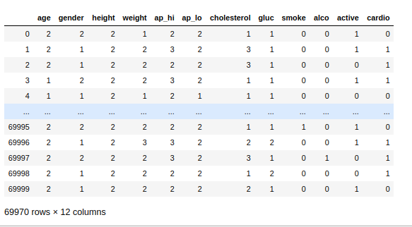
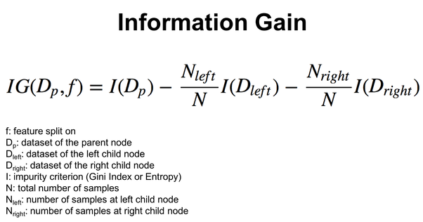
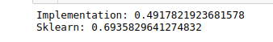
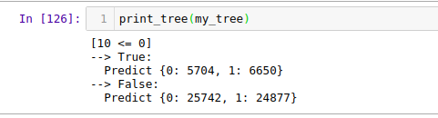

# Task 3 (Decision Trees )
### 1. Loading the data and did some preprocessing on it such as assuming categories for continous data and filling the missing data or adjusting the outliers

### *Then the data looks finally like* :
 > 
### 2.Training and test split to 90/10 
### 3.Started defining function:
## *Gini_impurity* :
### takes lable and label index, it counts how many unique values in the target and each unique value counts
## information_gain: Calculates info gain from the following formula:
> 

## *CaclSE*:
### Calculate variance of data to determine best split later
## SplitDataSet:
### Splitting data according to a value
## find_best_split:
### for each feature it takes the values and split it then calculate varience to get best feature and best value 
## *Count:*
### to get unique values and its count
## *Leaf ,Decision_Note :*
### Two classes to help building and printing the tree which i got from :
[Github](linkhttps://github.com/random-forests/tutorials/blob/master/decision_tree.ipynb)
## *build_tree:*
### Using all the previous functions to finaly build a tree and use a recursive method to repeat for each branch
## *Predict:*
### first it checks if we are at the leaf node then it keeps asking where is the new test data recursively .
## *Accuracy*:
### It measure the matches between predicted values and true values over the length of the data.

## Finally i tried sklearn code to compare both codes.

## <u>Results : <u>
  

